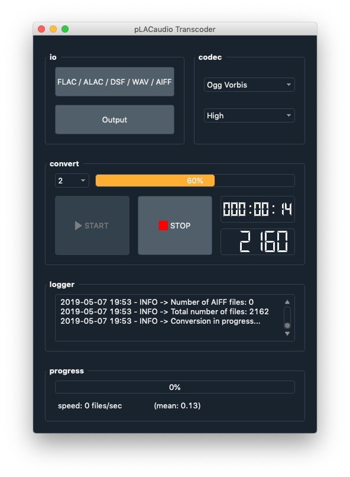

# pLACaudio

A minimalist tool designed for the simple and fast conversion of large libraries of lossless audio files.

Input folder of lossless files can include the following formats:
- ALAC
- [FLAC](https://xiph.org/flac/)
- [DSF](https://en.wikipedia.org/wiki/Direct_Stream_Digital) (Hi-Res Direct Stream Digital)
- WAV
- AIFF

Output formats are either lossless or lossy ones:
- ALAC, FLAC, WAV, AIFF
- [MP3](http://lame.sourceforge.net/)
- [Ogg Vorbis](https://xiph.org/vorbis/)
- [Opus](http://opus-codec.org/)

pLACaudio runs on a number of cores (conversion in parallel mode) chosen by the user for a fast conversion of a potentially large library.

pLACaudio uses ffMPEG (A complete, cross-platform solution to record, convert and stream audio and video). ffMPEG is a free software and is distributed under the terms of the GNU General Public License v3 see https://www.ffmpeg.org/ for more information).

Three settings of the output quality audio are possible (bit rate values).

  
  

  

   <b>pLACaudio on Windows 10, GNU/Linux and macOS</b>

Requirements
============

- Python 3 and PyQt5
- [ffMPEG](https://www.ffmpeg.org) converter

Use
===

An executable version is provided for:
- Windows 64 bits (setup installer with ffMPEG included). See the Release section.
- macOS (dmg disk with ffMPEG included). See the Release section.

For the use with CLI:
`>python3 pLACaudio.py`
and make sure that `ffmpeg` is a known executable of your operating system.

License
=======

This software is provided under the GNU GPL license v3

Contributions
=============

Contributions are welcome.

When contributing to **pLACaudio** please consider discussing the changes you wish to make via issue.

